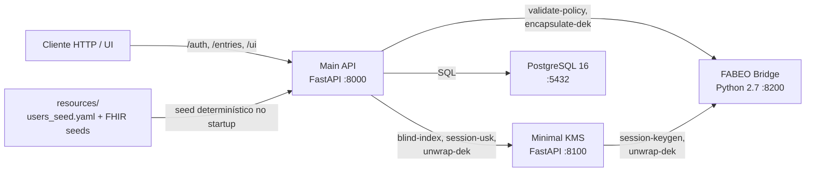
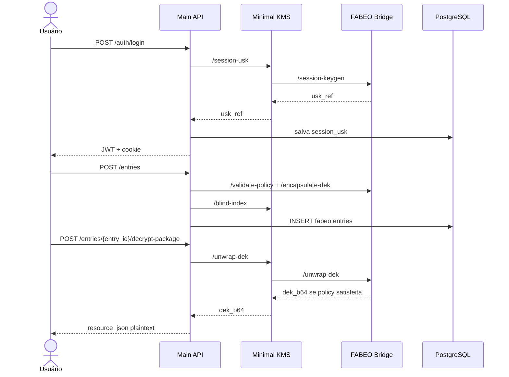

# MACHS2

MACHS2 é um MVP local de pesquisa para comparar estratégias de proteção criptográfica de prontuários eletrônicos baseados em recursos HL7 FHIR JSON. No estado atual do repositório, o fluxo operacional implementado é centrado no modo `fabeo`, com armazenamento híbrido:

- payload FHIR cifrado com `AES-GCM`;
- DEK encapsulada por CP-ABE via FABEO;
- blind indexes derivados por um KMS mínimo;
- autorização de leitura aplicada no fluxo `decrypt-package`.

O projeto foi estruturado como ambiente experimental reprodutível, não como sistema pronto para produção.

## Visão geral

O objetivo do MACHS2 é permitir experimentação controlada sobre:

- autenticação e sessão vinculadas a atributos;
- autorização ABAC para leitura de payload;
- busca por blind indexes sem expor plaintext ao banco;
- separação entre API pública, KMS, runtime CP-ABE e armazenamento relacional;
- validação empírica contra cenários de insider e observador de banco.

No snapshot atual do código:

- apenas o modo `fabeo` está operacionalmente implementado na API pública;
- os modos `aes_gcm`, `tde`, `column_level` e `app_level` aparecem como intenção arquitetural ou são explicitamente rejeitados;
- o schema efetivamente usado para entradas cifradas é `fabeo.entries`.

## Módulos principais

### Main API

Serviço principal em FastAPI, exposto na porta `8000`.

Responsabilidades:

- autenticação de usuários pré-semeados;
- emissão e validação de JWT em cookie HTTP-only;
- criação de entradas FHIR cifradas;
- busca por blind indexes;
- consulta de metadados;
- geração de `decrypt-package`.

Código principal:

- `services/machs_main_api/app/main.py`
- `services/machs_main_api/app/routers/auth.py`
- `services/machs_main_api/app/routers/entries.py`

### Minimal KMS

Serviço FastAPI exposto na porta `8100`.

Responsabilidades:

- derivar blind indexes por `HMAC-SHA256`;
- emitir referência de USK por sessão;
- fazer unwrap autorizado da DEK;
- expor MPK pública;
- manter o epoch experimental.

Código principal:

- `services/machs_minimal_kms/app/main.py`

### FABEO Bridge

Bridge HTTP executado dentro do container `machs_fabeo_service`, exposto na porta `8200`.

Responsabilidades:

- validar e normalizar políticas ABAC;
- gerar USK de sessão;
- encapsular a DEK por CP-ABE;
- realizar unwrap da DEK quando a política é satisfeita.

Código principal:

- `services/machs_fabeo_bridge/server.py`

### PostgreSQL

Banco relacional exposto na porta `5432`.

Responsabilidades:

- armazenar usuários e atributos;
- armazenar referências de sessão;
- armazenar políticas de exemplo;
- armazenar entradas cifradas em `fabeo.entries`.

Scripts principais:

- `db/init/01_schemas.sql`
- `db/init/02_policy_examples.sql`

## Arquitetura geral



## Fluxo principal



## Estrutura resumida do repositório

```text
.
|-- docker-compose.yml
|-- db/
|-- docs/
|-- resources/
|-- scripts/
|-- services/
|-- tests/
`-- README.md
```

Pastas de maior interesse:

- `services/`: serviços executáveis do sistema;
- `db/`: bootstrap do banco;
- `resources/`: usuários e recursos FHIR de seed;
- `scripts/`: benchmark, demos, reset e validação;
- `tests/`: testes de integração;
- `docs/`: documentação técnica detalhada.

## Execução rápida

### 1. Preparar ambiente

```bash
cp .env.example .env
```

### 2. Subir a stack

```bash
docker compose up --build
```

### 3. Verificar saúde

```bash
curl http://localhost:8000/health
curl http://localhost:8100/health
curl http://localhost:8200/health
```

### 4. Acessar UI

- `http://localhost:8000/ui/`

## Validação e benchmarking

Entradas principais para validação do MVP:

- `python tests/integration_smoke.py`
- `python tests/revocation_integration.py`
- `python scripts/validation/run_validation.py --iterations 500 --out-dir scripts/validation/output/<execucao>`
- `python scripts/benchmark/run_benchmark.py --base-url http://localhost:8000 --iterations 15 --out scripts/benchmark/output/results.json`

Observações:

- o benchmark atual mede apenas `fabeo`;
- a trilha de revogação por epoch é experimental;
- alguns scripts demo legados podem exigir ajuste de usernames em relação ao seed atual.

## Sumário da documentação

Leitura recomendada:

1. [Arquitetura](./docs/architecture.md)
2. [Estrutura do Projeto](./docs/project-structure.md)
3. [Banco de Dados](./docs/database.md)
4. [Referência da API](./docs/api-reference.md)
5. [Serviços Internos](./docs/internal-services.md)
6. [Autenticação e Autorização](./docs/authentication-and-authorization.md)
7. [Fluxos Criptográficos](./docs/cryptographic-flows.md)
8. [Fluxos Operacionais](./docs/operation-flows.md)
9. [Execução Local](./docs/running-locally.md)
10. [Testes e Benchmarking](./docs/testing-and-benchmarking.md)
11. [Segurança e Limitações](./docs/security-notes-and-limitations.md)

## Limitações importantes do estado atual

- apenas `fabeo` está implementado na API pública;
- `decrypt-package` devolve plaintext ao cliente autorizado;
- busca e consulta de metadados são menos restritas que a descriptografia;
- o bridge FABEO depende de stack legada com Python 2.7 e Charm 0.43;
- a revogação por epoch deve ser tratada como experimental;
- o sistema não deve ser descrito como production-ready.
