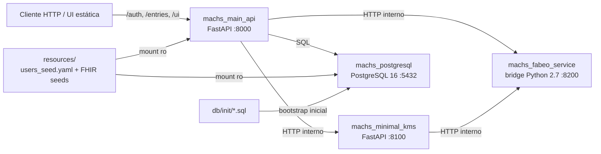

# Arquitetura do MACHS2

## Objetivo

Descrever a arquitetura executável do MACHS2 no estado atual do repositório, com ênfase em containers, dependências, fronteiras de confiança e fluxo de chamadas entre os serviços.

## Visão geral

O `docker-compose.yml` sobe quatro containers principais:

| Container | Tecnologia | Porta host | Papel principal |
| --- | --- | --- | --- |
| `machs_main_api` | FastAPI + Uvicorn | `8000` | API pública, autenticação, orquestração, busca, metadados e `decrypt-package` |
| `machs_minimal_kms` | FastAPI + Uvicorn | `8100` | Derivação de blind index, emissão de `usk_ref`, proxy de `public-mpk`, unwrap de DEK e epoch experimental |
| `machs_fabeo_service` | Ubuntu 16.04 + Python 2.7 + Charm + FABEO | `8200` | Runtime CP-ABE, validação de política, encapsulamento da DEK e unwrap autorizado |
| `machs_postgresql` | PostgreSQL 16 | `5432` | Persistência de usuários, sessões, exemplos de política e entradas cifradas |

## Papel de cada serviço

### 1. Main API

Implementada em `services/machs_main_api/app`.

Responsabilidades observadas no código:

- expor endpoints públicos HTTP;
- autenticar usuários pré-semeados;
- emitir JWT e cookie HTTP-only;
- solicitar ao KMS a emissão de uma referência de USK por sessão;
- validar superficialmente recursos FHIR;
- derivar campos pesquisáveis;
- solicitar blind indexes ao KMS;
- solicitar encapsulamento da DEK ao bridge FABEO;
- cifrar o payload com `AES-GCM`;
- persistir ciphertext e metadados no PostgreSQL;
- buscar metadados por blind index;
- solicitar ao KMS o unwrap da DEK durante `decrypt-package`;
- devolver o plaintext ao cliente autorizado.

### 2. Minimal KMS

Implementado em `services/machs_minimal_kms/app/main.py`.

Responsabilidades observadas:

- custodiar a MQK em memória de processo, carregada por variável de ambiente;
- derivar blind indexes por `HMAC-SHA256`;
- encaminhar a geração de sessão CP-ABE ao bridge FABEO;
- devolver somente uma referência `usk_ref` para a Main API;
- encaminhar unwrap de DEK ao bridge FABEO;
- expor a MPK publicamente;
- manter um `CURRENT_EPOCH` próprio para rotação experimental.

### 3. FABEO Bridge

Implementado em `services/machs_fabeo_bridge/server.py` e montado por volume dentro do container `machs_fabeo_service`.

Responsabilidades observadas:

- inicializar `PairingGroup('MNT224')` e `FABEO22CPABE`;
- normalizar e validar políticas ABAC;
- gerar chaves de sessão por atributos;
- encapsular um segredo GT para derivar a DEK;
- serializar o ciphertext CP-ABE;
- guardar as chaves de sessão em memória do processo (`SESSION_KEYS`);
- realizar unwrap autorizado da DEK a partir do `usk_ref`.

Importante: o código inspecionado implementa um fluxo CP-ABE real no bridge. Não foi identificada, no arquivo atual `server.py`, uma ramificação ativa de "envelope determinístico simulado" para criptografia local; esse ponto aparece em documentação legada do repositório, mas não como lógica operacional atual do bridge.

### 4. PostgreSQL

Inicializado com scripts em `db/init`.

Responsabilidades observadas:

- armazenar usuários em `public.users`;
- armazenar referências de sessão em `public.session_usk`;
- armazenar exemplos de políticas em `public.policy_examples`;
- armazenar entradas cifradas em `fabeo.entries`.

## Dependências e ordem de subida

Dependências declaradas em `docker-compose.yml`:

- `machs_main_api` depende de:
  - `machs_postgresql` saudável;
  - `machs_minimal_kms` saudável;
  - `machs_fabeo_service` saudável.
- `machs_main_api` também valida KMS e bridge em `startup_event()`.
- `machs_main_api` pode executar reset determinístico no startup quando `MAIN_API_RESET_ON_START=true`.

## Comunicação entre módulos

### Fluxo de alto nível

1. O cliente acessa `machs_main_api`.
2. A Main API autentica o usuário contra `public.users`.
3. No login, a Main API solicita `session-usk` ao Minimal KMS.
4. O Minimal KMS chama `session-keygen` no FABEO Bridge.
5. O bridge gera a chave de sessão CP-ABE e guarda o material em memória, retornando apenas `usk_ref`.
6. Na criação de entrada, a Main API:
   - valida a política com o bridge;
   - deriva blind indexes com o KMS;
   - encapsula a DEK com o bridge;
   - cifra o payload com `AES-GCM`;
   - grava tudo no PostgreSQL.
7. Na leitura autorizada, a Main API:
   - busca a linha em `fabeo.entries`;
   - envia `usk_ref` e `wrapped_key_b64` ao KMS;
   - o KMS chama o bridge para unwrap CP-ABE;
   - a Main API usa a DEK retornada para descriptografar e responder.

## Fronteiras de confiança

### Componentes tratados como confiáveis pelo MVP

- Main API
- Minimal KMS
- FABEO Bridge

### Componentes tratados como não confiáveis para confidencialidade do plaintext

- PostgreSQL, em especial para observador apenas de banco

### Consequência prática

O modelo do MVP protege o payload FHIR contra observação direta no banco e contra usuários autenticados sem atributos suficientes para satisfazer a política, mas ainda assume confiança nos processos de aplicação que manipulam plaintext em memória e na resposta HTTP autorizada.

## Implementação dos containers

### `machs_main_api`

- Base `python:3.11-slim`
- Instala `curl` para healthcheck
- Executa `uvicorn app.main:app --host 0.0.0.0 --port 8000`

### `machs_minimal_kms`

- Base `python:3.11-slim`
- Instala `curl` para healthcheck
- Executa `uvicorn app.main:app --host 0.0.0.0 --port 8100`

### `machs_fabeo_service`

- Base `ubuntu:16.04`
- Instala Python 2.7, Charm 0.43, GMP, PBC e o upstream FABEO
- O entrypoint operacional do MACHS2 não executa o servidor upstream do projeto FABEO; executa o bridge local montado em `/opt/machs2/bridge/server.py`

### `machs_postgresql`

- Base `postgres:16`
- Monta:
  - `./db/init` em `/docker-entrypoint-initdb.d`
  - `./resources` em `/workspace/resources:ro`

## Diagrama geral

## Observações arquiteturais relevantes

- A arquitetura sugere extensibilidade para múltiplos modos criptográficos, mas o repositório está operacionalmente fixado em `fabeo`.
- O bridge FABEO funciona como runtime CP-ABE embutido no container de um projeto upstream mais antigo, o que introduz dependências legadas fortes.
- O estado das chaves de sessão CP-ABE fica em memória do bridge, não no PostgreSQL.
- O endpoint `/entries/{entry_id}/cipher` devolve metadados, não os bytes do ciphertext.
- Busca e metadados são separados da autorização forte de descriptografia; a restrição ABAC é aplicada de fato no unwrap CP-ABE durante `decrypt-package`.
