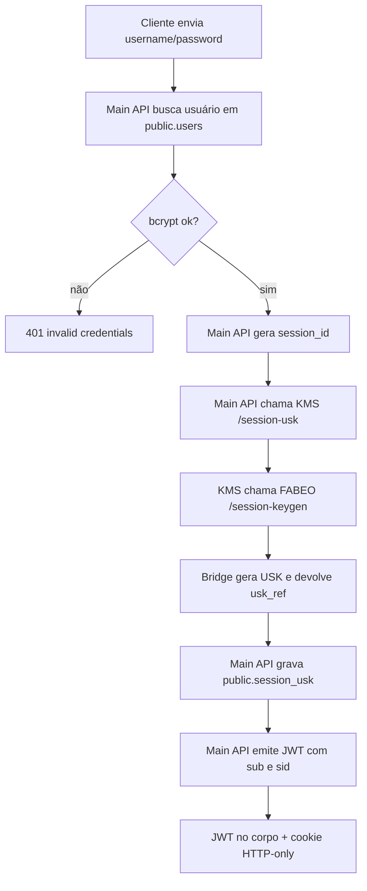
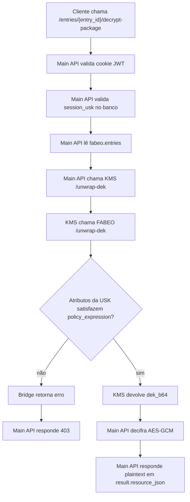

# Autenticação e Autorização

## Objetivo

Explicar como o MACHS2 autentica usuários, mantém o vínculo com uma sessão CP-ABE e aplica autorização baseada em atributos no fluxo de descriptografia.

## Visão geral

O controle de acesso observado no código possui duas camadas:

1. **Autenticação de aplicação**
   - JWT em cookie HTTP-only
   - validação de senha com bcrypt
   - sessão vinculada a `session_id`

2. **Autorização criptográfica**
   - emissão de uma referência de USK por sessão (`usk_ref`)
   - satisfação da política ABAC durante o unwrap da DEK via CP-ABE

## Fluxo de login

### Etapas

1. O cliente envia `username` e `password` para `POST /auth/login`.
2. A Main API busca o usuário em `public.users`.
3. A senha é comparada com `password_hash` por bcrypt.
4. A Main API gera um `session_id`.
5. A API envia `username`, `attributes`, `session_id` e `epoch` ao KMS.
6. O KMS solicita `session-keygen` ao bridge FABEO.
7. O bridge cria a USK da sessão e devolve `usk_ref`.
8. A Main API salva `session_id`, `username`, `usk_ref` e `expires_at` em `public.session_usk`.
9. A Main API emite um JWT com `sub` e `sid`.
10. O JWT é devolvido tanto no corpo quanto em cookie HTTP-only.

## Validação da sessão

O `Depends(get_current_user)` faz:

1. leitura do cookie;
2. decodificação do JWT;
3. extração de `sub` e `sid`;
4. validação de existência e atividade do usuário;
5. busca da `session_usk`;
6. verificação de expiração de `expires_at`.

Somente após essas etapas o contexto do usuário é aceito.

## TTL efetivo da sessão

Há dois relógios distintos:

- JWT: configurável por `MAIN_API_JWT_EXP_MINUTES` (default 120)
- `session_usk`: hardcoded no KMS como `time.time() + 3600`

Consequência:

- a sessão prática pode expirar antes do JWT;
- por padrão, a validade efetiva tende a ser de 1 hora por causa da `session_usk`.

## Logout

`POST /auth/logout` apenas apaga o cookie do cliente.

Limitações:

- não remove a `session_usk`;
- não revoga JWT;
- não mantém blacklist ou tabela de invalidação.

## Atributos ABAC

Os atributos vêm de `resources/users_seed.yaml` e são persistidos em `public.users.attributes`.

Exemplos de famílias de atributo observadas:

- `role.*`
- `department.*`
- `specialty.*`
- `clearance.*`
- `epoch.*`

## Política ABAC usada no decrypt-package

No código atual, a política relevante para autorização é o valor salvo em `fabeo.entries.policy_expression`.

Essa política:

- é validada e normalizada no bridge FABEO no momento da criação da entrada;
- é aplicada na prática quando o bridge tenta realizar o unwrap CP-ABE da DEK usando a USK da sessão;
- não é reavaliada por um parser booleano separado dentro do router `entries.py`.

Em outras palavras:

- a autorização de `decrypt-package` é criptográfica, não apenas lógica;
- se os atributos da sessão não satisfizerem a política, o unwrap falha e a API responde `403`.

## Diferença entre autenticação e autorização no MACHS2

### O que a autenticação libera

Usuário autenticado pode:

- consultar `/auth/me`;
- criar entradas;
- buscar por blind index;
- consultar `/entries/{entry_id}/cipher`;
- listar exemplos de política.

### O que continua protegido por política

Somente `POST /entries/{entry_id}/decrypt-package` força a satisfação da política CP-ABE.

Consequência importante:

- um usuário autenticado pode localizar ou inspecionar metadados de uma entrada sem conseguir descriptografá-la.

Esse comportamento aparece inclusive nos scripts de validação insider.

## Rotação de epoch e autorização

Há uma trilha experimental para epoch:

- o KMS mantém um `CURRENT_EPOCH`;
- o bridge incorpora o epoch aos atributos da USK;
- a Main API inclui `epoch_label` na entrada;
- existe endpoint `/entries/meta/epoch/rotate`.

Limitações observadas:

- a Main API continua usando `settings.current_epoch`, carregado no startup;
- não há recriptografia automática;
- não há prova no código de que a rotação, sozinha, invalide todas as sessões antigas de modo consistente;
- por isso, essa trilha deve ser tratada como experimental.

## Fluxograma do login

## Fluxograma de autorização no decrypt-package

## Pontos de atenção

- Busca e metadados não são equivalentes a autorização de leitura do payload.
- A USK real não é persistida no banco; só a referência é persistida.
- Se o bridge reiniciar, as USKs em memória podem se perder, mesmo com JWT e `session_usk` ainda presentes.
