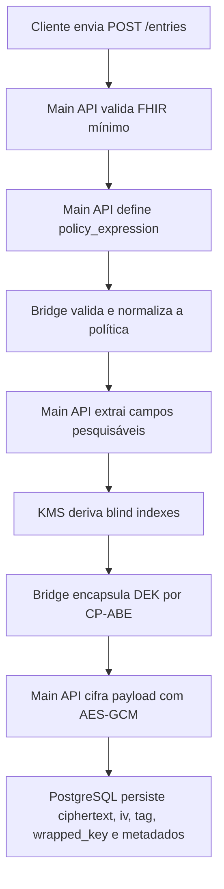
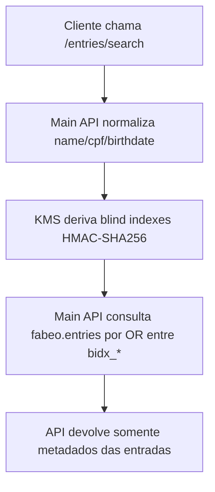
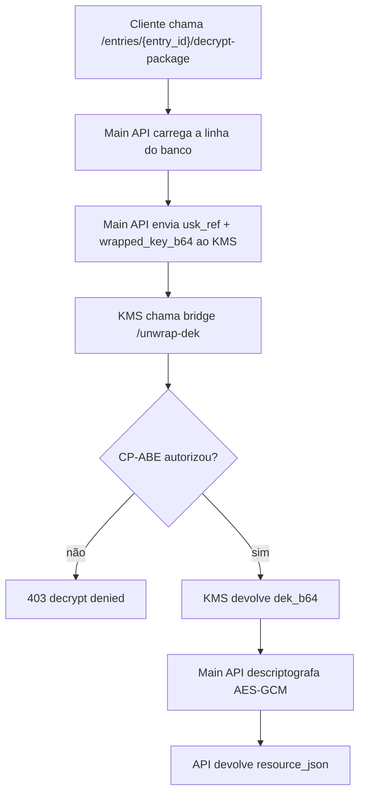
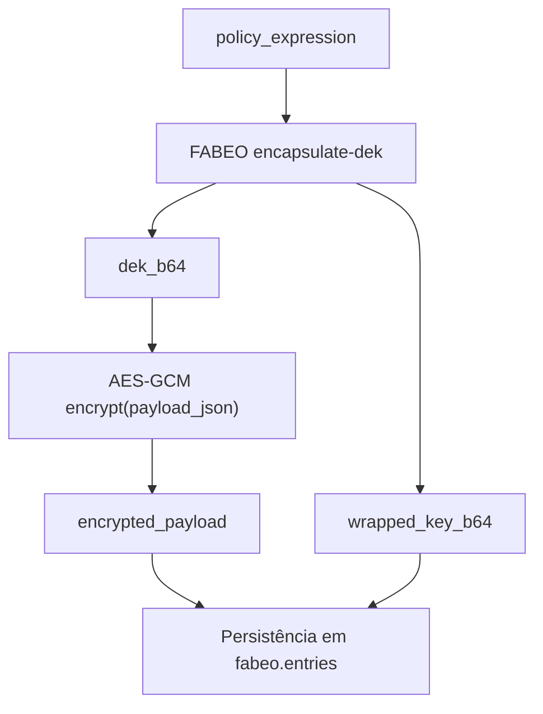
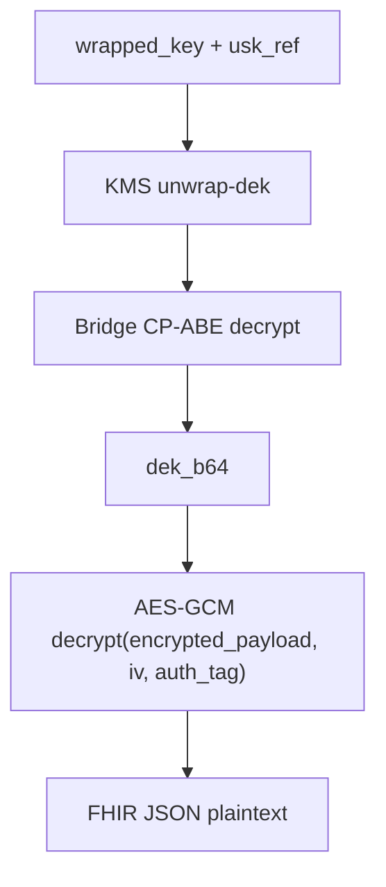

# Fluxos Criptográficos

## Objetivo

Descrever os modos criptográficos previstos, o modo efetivamente implementado, os blind indexes e os fluxos de criptografia/descriptografia observados no código.

## Modos criptográficos suportados

## Situação observada no código

| Modo | Situação | Evidência observada |
| --- | --- | --- |
| `fabeo` | implementado | aceito por `entries.py`, benchmark, validação e persistência em `fabeo.entries` |
| `aes_gcm` | não implementado na API pública | rejeitado por `_enforce_mode()` e por `tests/integration_smoke.py` |
| `tde` | não implementado na API pública | rejeitado por `_enforce_mode()` |
| `column_level` | não implementado na API pública | rejeitado por `_enforce_mode()` |
| `app_level` | não implementado na API pública | rejeitado por `_enforce_mode()` |

Conclusão: a arquitetura acadêmica admite expansão futura, mas o MVP inspecionado opera apenas em `fabeo`.

## Modo `fabeo`: o que ele realmente faz

O nome `fabeo` no repositório não significa que o payload inteiro FHIR é cifrado diretamente pelo esquema CP-ABE.

O fluxo atual é híbrido:

1. o bridge FABEO encapsula uma DEK por CP-ABE;
2. a Main API deriva a DEK a partir do segredo GT devolvido pelo bridge;
3. a Main API cifra o JSON FHIR com `AES-GCM`;
4. o banco armazena:
   - ciphertext `AES-GCM`;
   - `iv`;
   - `auth_tag`;
   - `wrapped_key` CP-ABE;
   - metadados do encapsulamento.

## Blind indexes

### Função

Permitem busca por alguns campos sem descriptografar todas as entradas.

### Algoritmo observado

No Minimal KMS:

- mensagem: `field + "|" + normalized_value`
- algoritmo: `HMAC-SHA256`
- chave: MQK carregada por `KMS_MQK_B64`
- saída: hexadecimal

### Campos indexados

A Main API tenta derivar:

- `name`
- `cpf`
- `birthdate`

### Limitação importante

A extração de campos pesquisáveis implementada em `fhir.py` só trata `Patient`.

Consequências:

- buscas por blind index são efetivas, na prática, para `Patient`;
- outros `resourceType` são persistidos sem blind indexes preenchidos.

## Papel do KMS

No fluxo criptográfico, o KMS:

- deriva blind indexes;
- emite apenas referência de USK, não a chave em si;
- encaminha unwrap de DEK ao bridge;
- expõe MPK;
- mantém um epoch experimental.

O KMS não cifra diretamente o payload FHIR.

## Papel do FABEO Bridge

No fluxo criptográfico, o bridge:

- valida sintaxe da política;
- transforma atributos e política no formato do esquema CP-ABE;
- executa `setup`, `keygen`, `encrypt` e `decrypt` do FABEO22CPABE;
- serializa o ciphertext CP-ABE;
- mantém USKs de sessão em memória.

## Fluxo de criptografia no modo `fabeo`

### Sequência lógica

1. A Main API recebe o recurso FHIR JSON.
2. Serializa o JSON preservando UTF-8.
3. Define ou recebe `policy_expression`.
4. Pede validação da política ao bridge.
5. Pede encapsulamento da DEK ao bridge.
6. Recebe:
   - `dek_b64`
   - `wrapped_key_b64`
   - `wrapped_key_meta`
7. Decodifica a DEK.
8. Gera `iv` aleatório.
9. Cifra o JSON com `AESGCM(dek).encrypt(...)`.
10. Separa ciphertext e `auth_tag`.
11. Persiste tudo em `fabeo.entries`.

### Metadados gerados

`wrapped_key_meta`:

- `cpabe_scheme`
- `kdf`

`mode_meta`:

- `fabeo_mode`
- `flow = cp_abe_fabeo_hybrid`

## Fluxo de descriptografia no modo `fabeo`

### Sequência lógica

1. A Main API carrega a entrada do banco.
2. Converte `wrapped_key` para base64.
3. Envia `usk_ref` da sessão e `wrapped_key_b64` ao KMS.
4. O KMS encaminha ao bridge.
5. O bridge:
   - encontra a USK em memória;
   - tenta decifrar o ciphertext CP-ABE;
   - se autorizado, devolve `dek_b64`.
6. A Main API decodifica a DEK.
7. A Main API reconstrói `ciphertext + auth_tag`.
8. Descriptografa com `AESGCM(dek).decrypt(...)`.
9. Devolve o JSON FHIR ao cliente.

## Fluxo nos modos AES-family

### Situação atual

Não há trilhas operacionais independentes para `aes_gcm`, `tde`, `column_level` e `app_level` na API principal.

O que existe hoje:

- um mecanismo `AES-GCM` usado internamente no modo `fabeo`;
- rejeição explícita dos outros modos nas rotas da API.

### Como documentar corretamente

Portanto, para o snapshot atual:

- não existe referência segura a endpoints públicos que operem nesses modos;
- não existe esquema SQL ativo separado para esses modos;
- não existe benchmark operacional desses modos na suíte atual.

## Fluxograma da criação de entrada

## Fluxograma da busca por blind index

## Fluxograma do decrypt-package

## Fluxograma da criptografia

## Fluxograma da descriptografia

## Observações críticas

- O plaintext não é armazenado no banco, mas é devolvido pela Main API em `decrypt-package`.
- O sistema não possui hoje um modo "CP-ABE puro" para o payload inteiro; o desenho é híbrido.
- O uso de `AES-GCM` existe, mas não como modo público separado.
- A autorização prática depende de a USK estar disponível na memória do bridge.
