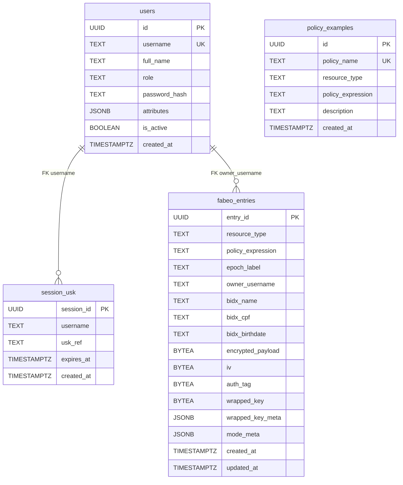

# Banco de Dados

## Objetivo

Documentar o modelo de dados realmente criado pelos scripts SQL e efetivamente utilizado pelo código da Main API.

## Visão geral

O bootstrap do banco é feito por `db/init/01_schemas.sql`, `02_policy_examples.sql` e `03_notes.sql`.

No snapshot inspecionado:

- o script cria apenas o schema `fabeo`;
- as tabelas públicas são `users`, `session_usk` e `policy_examples`;
- a Main API usa `ENTRY_SCHEMA = "fabeo"` de forma hardcoded;
- não há migrations formais além dos scripts de init do volume.

## Schemas identificados

| Schema | Situação no código atual | Observação |
| --- | --- | --- |
| `public` | ativo | usuários, sessão e exemplos de política |
| `fabeo` | ativo | entradas cifradas |

Observação importante: a descrição conceitual do projeto menciona outros schemas/modes (`aes_gcm`, `tde`, `column_level`, `app_level`), mas o SQL de bootstrap atual não os cria e o repositório da API não os utiliza.

## Tabelas públicas

### `public.users`

Finalidade:

- armazenar os usuários do seed e seus atributos.

Colunas:

| Coluna | Tipo | Observação |
| --- | --- | --- |
| `id` | `UUID` | PK, `uuid_generate_v4()` |
| `username` | `TEXT` | único, usado no login |
| `full_name` | `TEXT` | nome completo |
| `role` | `TEXT` | papel lógico do usuário |
| `password_hash` | `TEXT` | hash bcrypt |
| `attributes` | `JSONB` | lista de atributos ABAC |
| `is_active` | `BOOLEAN` | default `TRUE` |
| `created_at` | `TIMESTAMPTZ` | default `NOW()` |

Uso no código:

- `repository.get_user()`
- `repository.upsert_user()`

### `public.session_usk`

Finalidade:

- associar sessão da Main API a uma referência de chave CP-ABE emitida pelo KMS/bridge.

Colunas:

| Coluna | Tipo | Observação |
| --- | --- | --- |
| `session_id` | `UUID` | PK |
| `username` | `TEXT` | usuário dono da sessão |
| `usk_ref` | `TEXT` | referência opaca devolvida pelo bridge |
| `expires_at` | `TIMESTAMPTZ` | expiração da sessão CP-ABE |
| `created_at` | `TIMESTAMPTZ` | default `NOW()` |

Uso no código:

- `repository.upsert_usk()`
- `repository.get_usk()`
- `repository.clear_all_entries()`

Observações:

- há chave estrangeira `session_usk_username_fkey` para `public.users(username)`, com `ON UPDATE CASCADE`;
- o logout não apaga esta tabela;
- o reset determinístico a limpa.

### `public.policy_examples`

Finalidade:

- armazenar exemplos de políticas ABAC exibidos pela API.

Colunas:

| Coluna | Tipo | Observação |
| --- | --- | --- |
| `id` | `UUID` | PK |
| `policy_name` | `TEXT` | único |
| `resource_type` | `TEXT` | tipo FHIR associado |
| `policy_expression` | `TEXT` | expressão ABAC |
| `description` | `TEXT` | descrição humana |
| `created_at` | `TIMESTAMPTZ` | default `NOW()` |

Seed:

- `db/init/02_policy_examples.sql` insere 7 políticas.

## Tabela de entradas cifradas

### `fabeo.entries`

Finalidade:

- armazenar payload cifrado, blind indexes e metadados necessários ao fluxo híbrido `AES-GCM + FABEO`.

Colunas:

| Coluna | Tipo | Observação |
| --- | --- | --- |
| `entry_id` | `UUID` | PK |
| `resource_type` | `TEXT` | `Patient`, `Observation`, `Condition`, `Encounter` ou `MedicationRequest` |
| `policy_expression` | `TEXT` | política normalizada utilizada no encapsulamento |
| `epoch_label` | `TEXT` | epoch associado à entrada |
| `owner_username` | `TEXT` | usuário que criou a entrada |
| `bidx_name` | `TEXT` | blind index de nome |
| `bidx_cpf` | `TEXT` | blind index de CPF |
| `bidx_birthdate` | `TEXT` | blind index de data de nascimento |
| `encrypted_payload` | `BYTEA` | ciphertext do JSON FHIR |
| `iv` | `BYTEA` | nonce `AES-GCM` |
| `auth_tag` | `BYTEA` | tag `AES-GCM` |
| `wrapped_key` | `BYTEA` | ciphertext CP-ABE serializado |
| `wrapped_key_meta` | `JSONB` | metadados do encapsulamento |
| `mode_meta` | `JSONB` | metadados do modo/fluxo |
| `created_at` | `TIMESTAMPTZ` | criação |
| `updated_at` | `TIMESTAMPTZ` | atualização |

Uso no código:

- `repository.insert_entry()`
- `repository.search_entries()`
- `repository.get_entry()`
- `repository.clear_all_entries()`

## Índices relevantes

Criados em `db/init/01_schemas.sql`:

| Índice | Coluna |
| --- | --- |
| `fabeo_entries_bidx_name_idx` | `bidx_name` |
| `fabeo_entries_bidx_cpf_idx` | `bidx_cpf` |
| `fabeo_entries_bidx_birthdate_idx` | `bidx_birthdate` |
| `fabeo_entries_resource_type_idx` | `resource_type` |
| `fabeo_entries_created_at_idx` | `created_at` |

## Como o payload cifrado é armazenado

### Componentes persistidos

O fluxo híbrido grava:

- `encrypted_payload`: ciphertext do JSON FHIR cifrado com `AES-GCM`;
- `iv`: nonce aleatório de 12 bytes;
- `auth_tag`: tag de autenticação de 16 bytes;
- `wrapped_key`: ciphertext CP-ABE que encapsula a DEK;
- `wrapped_key_meta`: metadados como esquema e KDF;
- `mode_meta`: metadados de fluxo, por exemplo `cp_abe_fabeo_hybrid`.

### Blind indexes

São persistidos separadamente para consulta:

- `bidx_name`
- `bidx_cpf`
- `bidx_birthdate`

Observação: a extração desses campos é implementada apenas para `Patient`. Para os demais `resourceType`, esses campos tendem a ficar vazios.

## Armazenamento de dados sensíveis

### Protegidos em ciphertext

- JSON FHIR completo
- DEK efetiva

### Armazenados em metadados ou texto claro no banco

- `resource_type`
- `policy_expression`
- `epoch_label`
- `owner_username`
- blind indexes
- nomes de política na tabela de exemplos

Isso significa que o banco não vê o plaintext do payload FHIR, mas ainda vê metadados operacionais relevantes.

## Seed e reset

O seed de dados não vem de `INSERT` em recursos FHIR via SQL. O comportamento observado é:

1. `db/init/*.sql` cria estrutura base.
2. A Main API, no startup, chama `deterministic_reset_and_seed()` quando `MAIN_API_RESET_ON_START=true`.
3. Esse fluxo:
   - apaga `fabeo.entries`;
   - apaga `public.session_usk`;
   - upserta usuários de `resources/users_seed.yaml`;
   - cifra os recursos FHIR de `resources/seeds/*`;
   - insere as entradas já cifradas em `fabeo.entries`.

## Diagrama ER

## Limitações do modelo de dados

- Não há tabela de auditoria para tentativas de decrypt.
- Não há versionamento de policies nem histórico de epoch por entrada além do `epoch_label` textual.
- A função SQL `create_mode_table()` é genérica, mas foi invocada apenas para `fabeo`.
