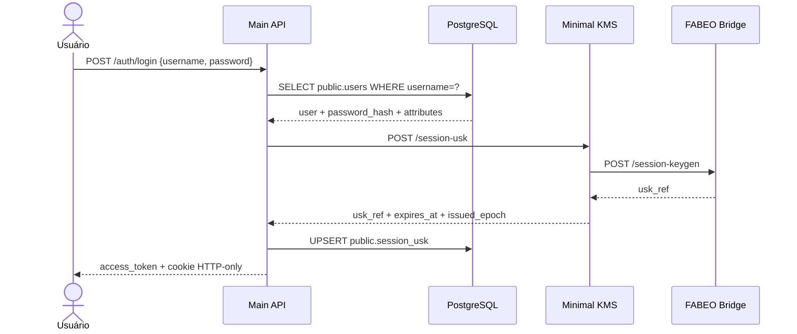
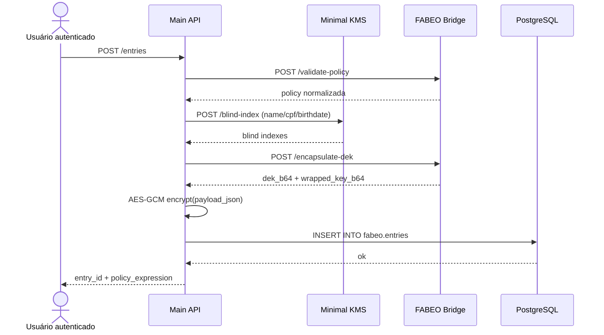
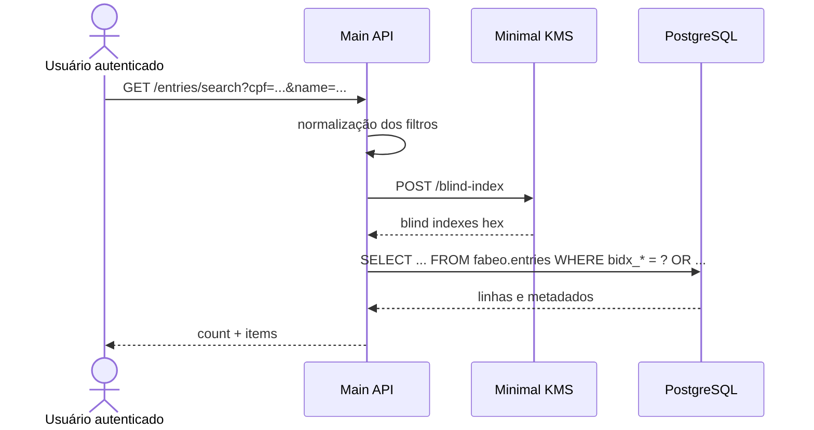
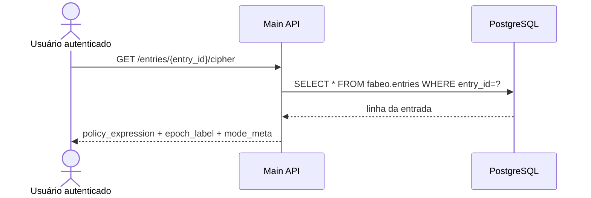
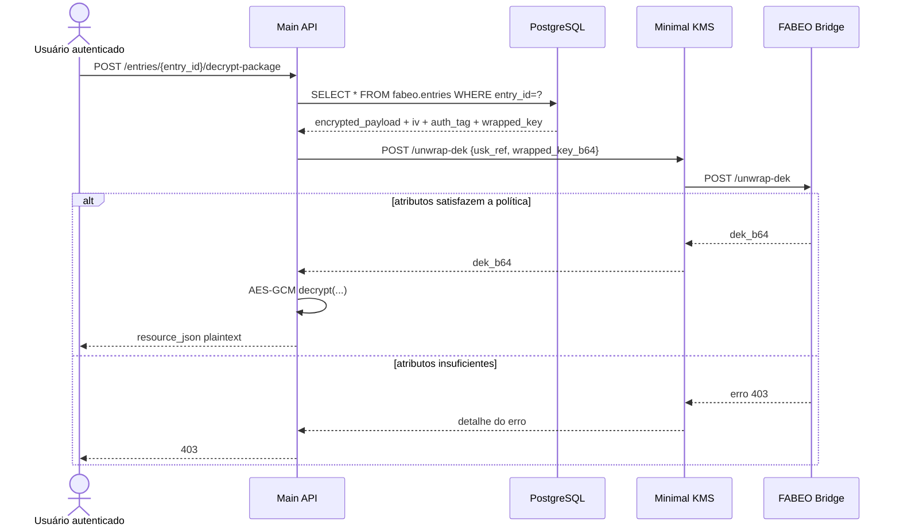
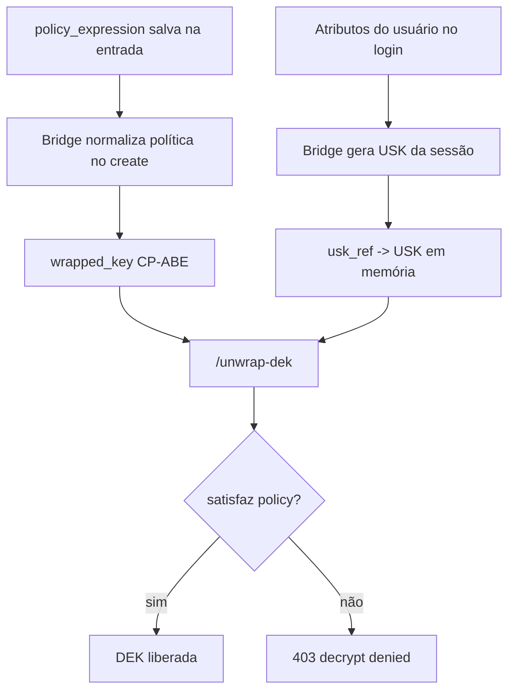
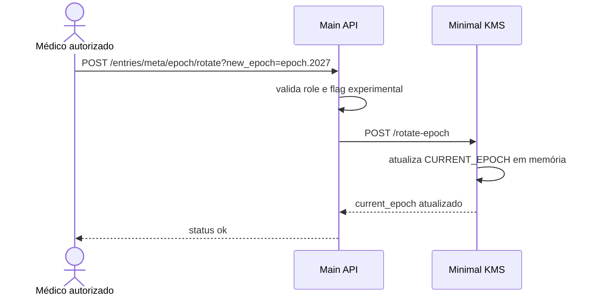
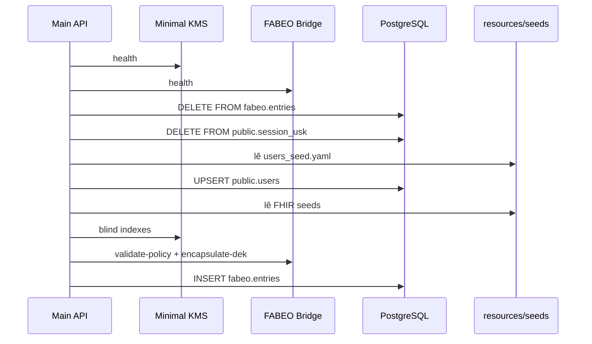

# Fluxos Operacionais

## Objetivo

Documentar os principais fluxos ponta a ponta do MACHS2 como operações completas entre cliente, Main API, KMS, FABEO Bridge e PostgreSQL.

## 1. Login

### Descrição

O login conecta autenticação tradicional a uma sessão criptográfica CP-ABE.

### Diagrama

## 2. Criação de entrada

### Descrição

Fluxo usado por `POST /entries` para cifrar e persistir um recurso FHIR.

### Diagrama

## 3. Busca

### Descrição

Fluxo usado por `GET /entries/search`.

### Observações

- a busca é por blind index;
- a combinação de múltiplos filtros é `OR`;
- a resposta contém metadados, não plaintext.

### Diagrama

## 4. Consulta de metadados/cipher

### Descrição

Fluxo usado por `GET /entries/{entry_id}/cipher`.

### Observação importante

Apesar do nome do endpoint, ele não entrega o ciphertext binário.

### Diagrama

## 5. Decrypt-package

### Descrição

Fluxo usado por `POST /entries/{entry_id}/decrypt-package`.

### Diagrama

## 6. Verificação de política ABAC

### Descrição

A política ABAC não é verificada por um motor booleano próprio da Main API no fluxo de `decrypt-package`. O enforcement ocorre quando a USK da sessão tenta abrir o `wrapped_key` CP-ABE.

### Diagrama

## 7. Rotação de epoch experimental

### Descrição

Há um fluxo experimental exposto por `POST /entries/meta/epoch/rotate`.

### O que o código faz hoje

1. exige usuário autenticado com papel médico específico;
2. verifica o flag `MAIN_API_ENABLE_EXPERIMENTAL_REVOCATION`;
3. chama `POST /rotate-epoch` no KMS;
4. o KMS troca o seu `CURRENT_EPOCH` em memória.

### O que o código não faz automaticamente

- não recriptografa entradas já existentes;
- não atualiza `settings.current_epoch` da Main API em runtime;
- não persiste histórico de epochs;
- não invalida explicitamente todas as `session_usk`.

### Diagrama

## 8. Fluxo de seed no startup

### Descrição

Se `MAIN_API_RESET_ON_START=true`, a Main API reseta e repovoa o ambiente no startup.

### Diagrama

## Observações finais

- O fluxo operacional dominante do sistema é `login -> create/search -> decrypt-package`.
- O fluxo de busca foi desenhado para permitir descoberta controlada por blind index, sem implicar autorização de leitura do payload.
- A trilha de revogação por epoch deve ser tratada como experimental e incompleta no estado atual do código.
